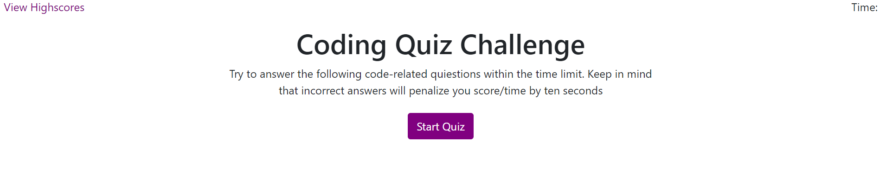

# Code Quiz

## Description

This web application is a coding quiz with multiple choice questions. When the start quiz button is clicked, a timer starts and the user is presented with questions. Whenever the user answers a wrong question, the timer will be subtracted. If the timer hits 0 the quiz will be over. The score is based on the amount of time left. Therefore the time is 0, the final score will be 0. The user will be to choose between clearing and storing the score. The scores will be sorted in order to show the highscore. Also the user can choose to restart the quiz.

**Note**: This web app is built with vanilla JS, CSS, and HTML.

## Usage

This web app can be used to test your basic coding knowlgde by answering the questions. Additional questions can be added to this application, since it is very simple to use and rebuild. The following image is the preview of the web application.

**Note**: This a link to the actual website: [Code Quiz Official Website](https://alsharifnahas.github.io/Code-Quiz/.)

## Liecense

MIT License

Copyright (c) [2020] [Alsharif Nahas]

Permission is hereby granted, free of charge, to any person obtaining a copy
of this software and associated documentation files (the "Software"), to deal
in the Software without restriction, including without limitation the rights
to use, copy, modify, merge, publish, distribute, sublicense, and/or sell
copies of the Software, and to permit persons to whom the Software is
furnished to do so, subject to the following conditions:

The above copyright notice and this permission notice shall be included in all
copies or substantial portions of the Software.

THE SOFTWARE IS PROVIDED "AS IS", WITHOUT WARRANTY OF ANY KIND, EXPRESS OR
IMPLIED, INCLUDING BUT NOT LIMITED TO THE WARRANTIES OF MERCHANTABILITY,
FITNESS FOR A PARTICULAR PURPOSE AND NONINFRINGEMENT. IN NO EVENT SHALL THE
AUTHORS OR COPYRIGHT HOLDERS BE LIABLE FOR ANY CLAIM, DAMAGES OR OTHER
LIABILITY, WHETHER IN AN ACTION OF CONTRACT, TORT OR OTHERWISE, ARISING FROM,
OUT OF OR IN CONNECTION WITH THE SOFTWARE OR THE USE OR OTHER DEALINGS IN THE
SOFTWARE.

© 2020 Alsharif Nahas. Confidential and Proprietary. All Rights Reserved.
